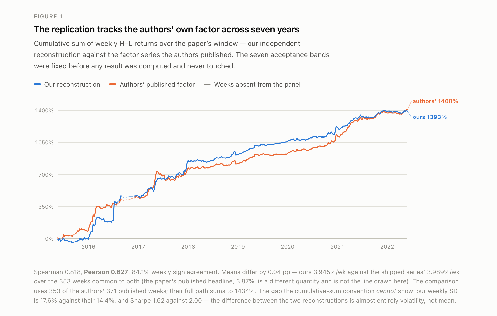
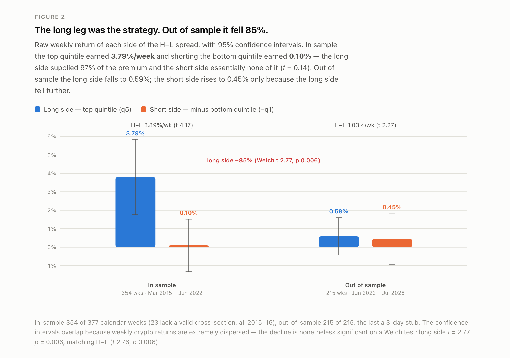
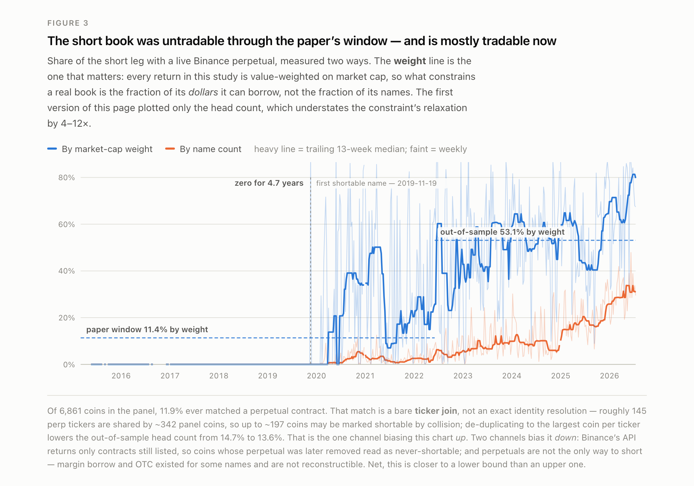
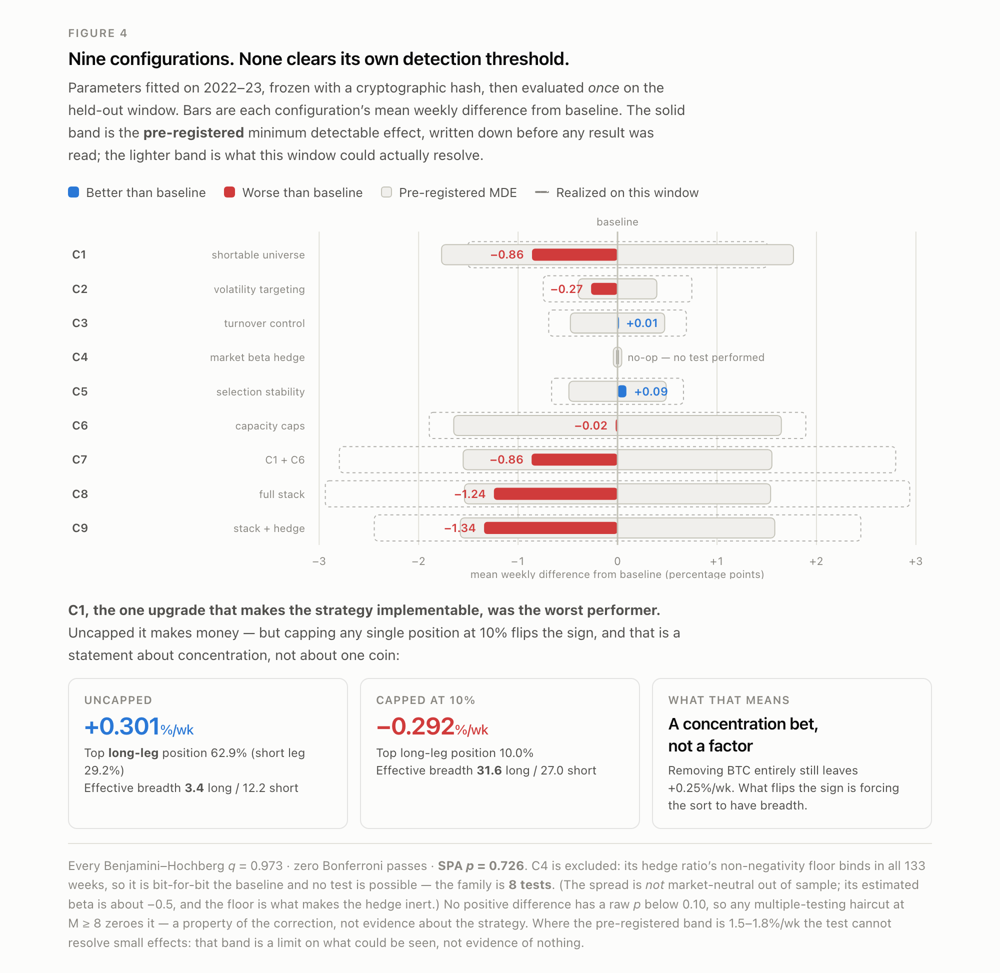

# CTREND

Replication and out-of-sample extension of Fieberg, Liedtke, Poddig, Walker & Zaremba,
*A Trend Factor for the Cross Section of Cryptocurrency Returns*, **JFQA 60 (2025),
3116–3153**.

2026-07-21 · 177 tests green · Python 3.12, laptop scale (pandas + parquet + DuckDB)

> This is **evidence, not a trading system**. No live orders were placed or enabled at
> any point; the codebase contains no order-placement path. Not investment advice.

> **Correction notice — 2026-07-21.** An adversarial audit confirmed 34 defects across
> this repository. The findings that changed on this page:
>
> 1. **The leg decomposition was mislabelled (retracted claim).** Every previous
>    statement about which leg carries the premium — "the long and short legs
>    contributed roughly equally", "85% of what remains comes from shorting the bottom
>    quintile" — silently quoted *market-relative* legs (q5 − mkt, mkt − q1) while
>    reading as raw returns. On **raw** returns the long leg supplied **97%** of the
>    in-sample premium and collapsed 85% out of sample. **The "surviving premium sits in
>    the short leg" thesis is withdrawn.**
> 2. **Shortability was understated.** The old 1.0% / 14.7% figures are *headcount*
>    shares. Every return here is value-weighted, so the *weight* share is what bears on
>    tradability: **11.4% in-sample, 53.1% out-of-sample, 62.0% over the last 52 weeks.**
>    A majority of the short book by dollar weight was shortable out of sample.
> 3. **The mask's bias direction was reversed.** We called the perpetuals mask an
>    *upper* bound on shortability. `exchangeInfo` survivorship biases it **down**, not
>    up. See "What to trust".
> 4. **The C4 beta claim was wrong and is deleted.** C4's 0.0048 was a zero-floored
>    hedge ratio at a *discarded* tuning parameter, not a market beta, and did not
>    reproduce the paper's βCMKT. The spread's true out-of-sample beta is about **−0.5**.
>    The spread is **not** market-neutral out of sample.
> 5. **The upgrade experiment was not reproducible run-to-run.** An unordered DuckDB
>    `SELECT` under `PRAGMA threads=4` made float summation order vary. Pinned with
>    `ORDER BY`: **SPA p = 0.726** (was 0.643, re-runs ranged 0.221–0.877), C4 is a
>    bit-exact no-op with no test statistic, and the family is **8 tests, not 10**.
>    Every other configuration is unchanged to three decimals; the parameter freeze held.
> 6. **The Harvey–Liu–Zhu haircut result was a saturation artifact**, not evidence.
> 7. **"It is a BTC bet" was false.** C1 uncapped is a *concentration* bet: deleting
>    Bitcoin entirely leaves +0.248%/wk of the uncapped +0.301%/wk.
> 8. Assorted counts and dates: the window starts **Mar 2015**, not April, and ends
>    **Jun 2022**, not May; correlation is reported with Pearson alongside Spearman.
>
> What did **not** change: the replication succeeds, the decay is real, and the upgrade
> experiment is still a null.

---

## The replication succeeds. The strategy does not survive out of sample at an implementable magnitude.

**We reproduced the paper.** Over its own window (**Mar 2015 – Jun 2022**, Liu weeks
201510–202222, 354 of 377 calendar weeks — 23 lack a valid cross-section, all in
2015–16) all **seven** immutable §7 acceptance bands pass: H−L **3.945%/week**
(paper 3.87), Sharpe **1.620** (1.94), CMOM beta **0.771** (0.79), alpha vs LTW
**2.94%** with t **3.42**, turnover **70.1%** (68.45). Against the authors' own
published factor series our reconstruction correlates at **Pearson 0.627 / Spearman
0.818** with **84.1%** weekly sign agreement. Net-of-cost returns land on the paper's
Table 9 almost exactly (2.95 / 2.67 / 2.39 vs 2.90 / 2.62 / 2.35), and breakeven
transaction cost matches at **1.41%**. None of this was calibrated; the bands were fixed
before any result was computed.

Three qualifications, all of which earlier versions of this page elided:

* The comparison to the authors' series is an inner join on **353 of their 371 published
  weeks**. Over those 353 weeks their mean is **3.989%/week** against our 3.945 — the
  **0.04 pp** gap quoted previously. It is *not* a gap against the paper's Table 3
  headline of 3.87%, which is a different quantity (their full 371-week series means
  3.866%). The 18 dropped weeks sum to +26.06 pp; their full series cumsums to 1434%.
* Higher moments match less well than the mean: weekly SD **17.57% vs 14.40%**, Sharpe
  **1.620 vs 1.997**. Quoting Spearman alone was selective; `reports/m3_validation.md`
  lists both coefficients adjacently.
* §7 is not the only set of pre-registered gates. The **M1 sample gate failed**
  (14/40 cells — deliberately not tuned away), and the factor-reconstruction gate passed
  for **CMKT only** (0.954); **CSMB 0.511** and **CMOM 0.723** fell below the 0.95
  threshold. "The replication succeeds" is supportable. "Replicated perfectly" is not.

**Extended to today (215 genuinely out-of-sample weeks, 202223–202629, to July 2026 —
the final week is a 3-day stub, the daily panel ending 2026-07-18), it decays by 73%** —
from 3.894%/week to **1.030%/week**. The frictionless spread stays statistically
significant (t = 2.27) but at roughly a quarter of its historical size.

**Every implementable version loses significance:**

| | in-sample | out-of-sample |
|---|---|---|
| paper-faithful H−L | 3.894%/wk (t 4.17, n 354) | **1.030%/wk** (t 2.27, n 215) |
| short book restricted to what could be shorted | 2.919%/wk (t 1.50, n 56) | **0.684%/wk** (t 1.20, n 205) |
| long-only, top-half liquidity | 3.692%/wk (t 4.00, n 313) | **0.526%/wk** (t 1.00, n 215) |

**Why: the long leg — the tradable side — is what collapsed.** This is a reversal of
what this page previously said, and the reason is a labelling error. There are two valid
leg decompositions and they tell opposite stories:

| leg | in-sample | out-of-sample |
|---|---|---|
| **raw** long (q5) | **+3.794%/wk — 97%** of H−L (t 3.66) | **+0.585%/wk — 57%** (t 1.14) |
| **raw** short (−q1) | +0.101%/wk — 3% (t 0.14) | +0.445%/wk — 43% (t 0.63) |
| market (mkt) | +1.939%/wk | +0.438%/wk |
| *market-relative* long (q5 − mkt) | +1.855%/wk — 48% | **+0.148%/wk — 14%** |
| *market-relative* short (mkt − q1) | +2.039%/wk — 52% | **+0.882%/wk — 86%** |

**Retracted.** Earlier versions of this README stated that "in sample the long and short
legs contributed roughly equally (1.85% and 2.04%/week)" and that "85% of what remains
comes from shorting the bottom quintile". Both sentences quoted the **market-relative**
rows while reading as raw returns. In raw terms the long leg supplied **97%** of the
in-sample premium and then fell **85%**, from 3.794 to 0.585%/week. The claim that the
surviving premium sits in the short leg **does not hold on raw returns and is
withdrawn**. The market-relative decomposition is not wrong — it is the right lens for
asking what the sort adds over holding the market — but it must be labelled as such and
must not be used to argue about tradability.

The corrected reading is harsher, not kinder. The leg you can actually put on without a
borrow is the long leg, and it is the leg that went to nearly nothing.

**Shortability, in headcount and in weight.** Only **11.9%** of the 6,861 coins in our
panel ever had a Binance perpetual, and the first contract onboarded in **September
2019** — a **4.71-year** run (2015-03-11 → 2019-11-25) in which nothing in the short book
was shortable at all. Of the names the strategy wants to short:

| | headcount | market-cap weight |
|---|---|---|
| paper window | 0.94% | **11.37%** |
| out-of-sample | 14.69% | **53.09%** |
| last 52 weeks | 26.34% | **62.01%** |

Every return on this page is value-weighted, so the **weight** column is the one that
bears on tradability — and by weight the **majority of the out-of-sample short book was
shortable**. This is a material softening of the old "mostly unshortable" framing. It is
also why the masked-short variant (0.684%/wk) sits *above* long-only (0.526%/wk): what
the mask removes is a long tail of tiny names, not the bulk of the book.

*(The headcount figures moved marginally from the previously published 0.95% / 14.75%:
three `PENDING_TRADING` contracts that never traded are now excluded, and the mask
applies the onboard/offboard **interval** predicate rather than a half-line. The
masked-short variant was previously reported at 0.61%/wk, t 1.06; it is 0.684%/wk,
t 1.20.)*

**Timing — unstable, not a smooth decline.** By calendar year the frictionless spread
returned +187% (2023), **−41.9% with a 59.8% drawdown (2024)**, **+166.4% (2025)**, and
−14.2% in 2026 to date. The 1.03%/week out-of-sample average is the mean of wildly
dispersed annual outcomes, not a stable reduced edge. Note the worst year *precedes* the
paper's 2025 publication, which weakens a simple "arbitraged-away" reading.

**The tradable version lost money even in the good year.** In 2025 the frictionless
spread returned +166.4% while long-only-within-liquid-names returned **−13.0%**, and
**−27.6%** net of 50/60 bps. In 2026 to date: −35.2% and −41.6% net.

**One reading is kinder.** Volatility fell from 17.6% to 6.7% weekly, so the Sharpe
(1.12) degrades far less than the mean. A volatility-targeting investor would see a
milder deterioration than the raw spread implies.

---

## Can it be repaired? A pre-registered test of six upgrades says no.

Six candidate upgrades were implemented, each with a **bit-exact identity default** so
the baseline could not move silently. Parameters were fitted on 2022–23, **frozen with
an integrity SHA**, and the resulting **nine configurations** — the six single upgrades
plus three stacks — evaluated **once** against the baseline on 2024–26 (133 weeks).
Eight of the nine yield a test statistic; C4's difference from baseline is identically
zero, so the family is 8 (see below). Minimum detectable effects were written down
before any result was read.

| config | mean %/wk | Sharpe | max DD | diff vs base | t |
|---|---|---|---|---|---|
| **C0 baseline** | 0.522 | 0.500 | −62.1 | — | — |
| C1 shortable universe + name cap | **−0.292** | −0.381 | −66.4 | **−0.860** | −1.95 |
| C2 vol targeting | 0.256 | 0.340 | **−49.2** | −0.266 | −1.22 |
| C3 turnover control | 0.530 | 0.548 | −55.6 | +0.008 | 0.04 |
| C4 beta hedge + funding | 0.522 | 0.500 | −62.1 | exactly 0 | — (excluded) |
| C5 selection stability | **0.611** | 0.594 | −52.2 | +0.089 | 0.46 |
| C6 capacity caps | 0.503 | **0.609** | **−48.3** | −0.019 | −0.03 |
| C7–C9 stacks | −0.30 … −0.85 | negative | −56 … −75 | −0.86 … −1.34 | — |

**Reproducibility defect, now fixed.** `harness.load_panel` ran an unordered `SELECT`
under `PRAGMA threads=4`, so float summation order varied between runs. This was
harmless everywhere except C4, whose true difference from baseline is **exactly zero** —
there the rounding noise *was* the entire signal, and C4's t wandered across re-runs
(−2.25, −0.20, +0.08, +0.72, +1.63, +2.19). With row order pinned by `ORDER BY`, C4's
difference is 0.0 every run, `paired_t`'s zero-variance guard fires, and **C4 has no t,
no p, no q and no haircut — it is excluded from the family. The family is 8 tests, not
10**, and Bonferroni and BH now run on 8. Every other configuration is unchanged to
three decimals. **The freeze held**: re-running tuning selected identical parameters and
byte-identical MDEs, with movement only in the 16th significant digit of `vol_target`.
The integrity SHA is now `d2bfa8363dd1`.

**Decisive null.** Every BH q-value is 0.973, zero Bonferroni passes, and **SPA p =
0.726** — stable across runs, where the previously published 0.643 was not (re-runs gave
0.221–0.877).

**The Harvey–Liu–Zhu line has been withdrawn.** This page previously reported that the
HLZ haircut "zeroes the three positive differences at M = 10". That is an artifact:
`stats.py` clips the adjusted p at 1 − 1e-12, so **any** p_raw above 0.10 yields
t_adj ≈ 0 and a haircut of ≈ 0 for **any** Sharpe, however large. It said nothing about
this strategy. The correct statement is the weaker and more honest one: **no positive
difference has p_raw below 0.10, so any multiple-testing haircut at M ≥ 8 zeroes it.**
Two further fixes: the haircut now rescales the **paired-difference** Sharpe (new
`diff_sharpe` column) by the paired-difference t, which is the actual HLZ procedure —
previously it rescaled the *level* Sharpe by the *difference's* t — and M is the number
of tests performed (8), not `len(table)` (10, which counted the baseline).

**Pre-registered MDEs are ex-ante, not this window's power.** `run_experiment` estimates
the MDE standard deviation on the 82-week 2022–23 **tuning** window — a roughly 3.5×
stronger regime — and divides by √133 for every configuration, including those where
fewer weeks survive. A new `mde_realized_pct` column reports the evaluation-window
threshold, and the two differ substantially (C1 1.769 vs 1.506; C2 0.395 vs 0.747;
C3 0.474 vs 0.692; C5 0.489 vs 0.663; C6 1.647 vs 1.893; C7 1.552 vs 2.797; C8 1.539 vs
2.938; C9 1.581 vs 2.446). We keep the frozen number — pre-registration is the whole
point — but it should be read as the **ex-ante MDE estimated on the 2022–23 tuning
window**, cited beside the realized one. Note also that C8 reaches **81%** and C9 **85%**
of their frozen bands: "nothing comes close" would be false. **"No configuration clears
its own threshold" is true**, and that is the claim.

Two results carry information beyond the null:

* **C1, the highest-expected-value upgrade, is the worst.** Restricting to coins with a
  live perpetual gives −0.29%/wk against +0.52% baseline. Uncapped it makes +0.30%/wk
  with a top-1 weight of 0.629 and effective N of 3.45; capping names at 10% (top-1 →
  0.100, effective N → 31.6) flips the sign. It also failed in the tuning window, so this
  is not a regime artefact. **The edge lives in the names you cannot short.** But the
  gloss "it *is* a BTC bet" was **wrong and is retracted**: deleting Bitcoin entirely
  still leaves the uncapped variant at **+0.248%/wk — 82% of the +0.301%** — BTC is the
  top-1 name in only 69 of 125 weeks, and the cap flips the sign even with BTC removed.
  It is a **concentration** bet, not a Bitcoin bet. (The 0.629 / 3.45 figures are also
  **long-leg only**; the short leg runs 0.292 / 12.19.)
* **C4 is a no-op, and the reason is not the one we gave.** The claim that C4's flatness
  showed a "mean beta of 0.0048", "independently reproducing the paper's own
  βCMKT ≈ 0.03", is **deleted — it was wrong three ways.** 0.0048 is a zero-floored
  *hedge ratio* (`overlays.py`, `beta_min=0.0`), not a market beta; it only arises at
  `beta_window=26`, a **discarded** tuning candidate, and the accompanying "10 of 133
  weeks" and "+0.0009%/wk funding" figures are bw=26 artifacts too — at the frozen
  `beta_window=52` the clipped beta is exactly 0.000000 and exceeds 0.01 in **0 of 133**
  weeks. And the spread's true evaluation-window beta is strongly **negative**: rolling
  mean **−0.468**, static OLS **−0.535**. The correct statement: **C4 is a no-op because
  the hedge ratio's non-negativity floor binds in all 133 weeks. The spread is not
  market-neutral out of sample; it is short the market at roughly −0.5 beta.**

Where the design *did* help was risk, not return: C6 cut max drawdown 62.1% → 48.3% and
raised Sharpe to 0.609 on a slightly lower mean. That matches the pre-registered
expectation that 133 weeks resolves risk metrics far better than means.

Full detail, including per-configuration MDEs and the tuning-vs-evaluation transfer
table: [`reports/upgrades_evaluation.md`](reports/upgrades_evaluation.md).

---

## What to trust, and what not to

**Reliable:** the in-sample replication. It matches the authors' own factor week by week,
not merely on average, and reproduces their cost table and breakeven figure
independently. Rank agreement is much stronger than level agreement (Spearman 0.818,
Pearson 0.627), and our reconstruction is more volatile than theirs (SD 17.57 vs
14.40%) — so trust it as a reproduction of the *signal*, less so of the exact magnitudes.

**Solid but caveated:** the out-of-sample decay. It rests on a panel rebuilt from CMC
daily snapshots, since the authors' replication package ships **MATLAB code only, no
data**. Our universe runs ~16% larger than theirs from 2018 onward because CMC has
backfilled its history since 2022 — a documented failure of the M1 sample gate (14/40
cells) that we deliberately did **not** tune away.

**The main residual limitation:** high/low data is missing for ~5% of coin-weeks,
concentrated in delisted coins, which biases the short leg. The short leg still carries
43% of the surviving out-of-sample premium in raw terms (86% market-relative), so this
remains the one open item that could move the out-of-sample number — though it is no
longer, as we previously claimed, where *most* of the premium lives.

**The perpetuals mask is bounded in both directions, and the direction we gave was
backwards.** Earlier versions of this page and of `reports/upgrades_evaluation.md` said
`exchangeInfo` survivorship makes the mask an *upper* bound on shortability. **It is the
opposite:** a coin that had a perpetual and was later fully delisted is absent from
`exchangeInfo` and reads as never-shortable, which can only **shrink** the shortable set.
`src/ctrend/costs/feasibility_mask.py` and `reports/m6_decay_report.md` §3 always said
"lower bound"; those two pages contradicted them, and both are now corrected. Both named
mechanisms —
`exchangeInfo` survivorship, and perpetuals not being the only venue to short (margin
borrow and OTC existed) — bias the mask **down**. The one channel biasing it **up** is
that shortability is assigned by a bare **ticker** match (`feasibility_mask.py` joins
`upper(perp.base) = panel.sym`): ~145 perpetual tickers are shared by ~342 panel coins,
so up to ~197 coins may be marked shortable purely by ticker collision. Deduplicating to
the largest coin per ticker drops the out-of-sample headcount share from 14.7% to 13.6%.
**The mask is therefore not exact** — it should not be described as one, as it was above
in earlier versions.

**One bias in the upgrade experiment still cuts toward optimism:** CMC volume is inflated
by wash trading, so C6's capacity constraint is looser than reality.

**Carried verbatim (SPEC §10):** the source paper's headline 3.87%/week is a frictionless
upper bound; its abnormal return concentrates in a short leg that was largely untradable
over the sample; backtested returns do not predict live returns. *(That middle clause is
the paper's own characterisation, reproduced as written. Our raw-return decomposition
does not reproduce it: in our replication the in-sample premium is 97% long leg. The
short-leg concentration appears only market-relative.)*

---

## Bottom line

CTREND was real and is faithfully reproducible over its published window. Four years on,
what remains is a ~1%/week frictionless spread that is statistically indistinguishable
from noise once implementation constraints are applied — before any borrow cost, funding,
market impact or capacity limit is considered, and against ~70% weekly turnover. Six
pre-registered upgrades, evaluated in nine configurations, produce no improvement that
survives multiple-testing correction.

**The reason is not the one this page gave until 2026-07-21.** We argued that the edge
survived in an untradable short book. On raw returns it is the reverse: the **long leg
was 97% of the in-sample premium and it is the leg that collapsed**, from 3.794 to
0.585%/week, with a t of 1.14. Meanwhile the short book turns out to be substantially
tradable — **53% of it by market-cap weight out of sample, 62% over the last 52 weeks** —
and the masked-short variant returns 0.684%/week at t 1.20. So the honest summary is
worse for the strategy, not better: the problem is not that the surviving premium is
unreachable, it is that **the reachable leg stopped paying**, and nothing that remains
clears significance. The spread is also not market-neutral out of sample (beta ≈ −0.5),
so part of what is left is directional market exposure rather than a cross-sectional
premium.

---

## Figures









Dark variants alongside each file in [`reports/figures/`](reports/figures/). Figures 2 and
3 are the two that the 2026-07-21 audit reversed — the first version plotted
market-relative legs labelled as raw returns, and an unweighted head count where the
argument needed market-cap weight.

---

## Repository

### Documents

| file | what it is |
|---|---|
| [`SPEC.md`](SPEC.md) | Authoritative spec. §§4–8 verbatim from the paper, then reconciled against the authors' MATLAB with 12 ground-truth corrections marked `[GT-n]` and evidenced to `file:line`. Acceptance bands in §7 are immutable. |
| [`DECISIONS.md`](DECISIONS.md) | Ambiguity ledger. Every deviation, its justification, and the evidence behind it. |
| [`EXECUTIVE_SUMMARY.md`](EXECUTIVE_SUMMARY.md) | The replication + decay findings above, standalone. |
| [`validation_report.md`](validation_report.md) | Full validation: gates, diagnostics, and the bugs found and fixed along the way. |
| [`UPGRADE_PLAN.md`](UPGRADE_PLAN.md) | Pre-registration for the upgrade experiment, written before results. |
| [`reports/`](reports/) | Per-milestone gates and outputs: `m1_table1_gate.md`, `m2_table2_gate.md`, `m3_validation.md`, `m6_decay_report.md`, `upgrades_evaluation.md`. |
| [`configs/frozen_params.json`](configs/frozen_params.json) | Frozen upgrade parameters with integrity SHA `d2bfa8363dd1…`. |

### Code

```
src/ctrend/
  calendar.py        Liu year-block weeks (GT-1): fixed 7-day blocks from Jan 1,
                     52 weeks/year, week 52 absorbs 8–9 days, phase resets annually
  data/              the Dataset.asof contract — the sole data-access path, which
                     is what makes invariant 1 testable rather than aspirational
  ingest/            CMC snapshots + OHLC, Gandal CC0 backfill, Binance funding,
                     daily → weekly curation
  indicators/        the 28 technical indicators, cross-sectional rank mapping
  signal/            CS-C-ENet: 28 univariate WLS regressions → smoothed (α,β) →
                     forecasts → ElasticNet with AICc λ selection
  portfolio/         value-weighted quintile sorts, GKX turnover, overlays
  costs/             transaction costs, Binance perpetual feasibility mask
  evaluation/        acceptance gates, factor regressions, KPIs
  experiments/       pre-registered harness: windows, freeze, BH/Bonferroni/HLZ/SPA
```

### Running it

```bash
make setup        # uv venv --python 3.12 && uv pip install -e .
make ingest       # build the panel     (needs data — see below)
make indicators   # 28 indicators, rank-mapped
make signal       # CS-C-ENet forecasts
make backtest     # quintile sorts, turnover, costs
make validate     # acceptance gates
make test         # 177 tests
```

**Scale.** **20.67M raw CMC daily snapshot rows** (20,673,212 across 34,107 coin ids)
→ a curated daily panel of 19,526,231 rows / 31,856 coins → 8,648,498 coin-days once
restricted to the 6,861 panel coins → **626k coin-weeks** (625,964). Earlier versions of
this repository described the 20.67M figure as "coin-days", which it is not.

**Data is not in this repo.** `data/` and `*.parquet` are gitignored — the curated panel
is ~2 GB and the CMC snapshot history is not ours to redistribute. `make ingest`
rebuilds it from source; see [`DECISIONS.md`](DECISIONS.md) Part 3 for exactly which
sources were used and how identity was resolved across them. The Gandal et al. daily
history is CC0 via Harvard Dataverse (`doi:10.7910/DVN/JPEF8T`,
`doi:10.7910/DVN/H98LCZ`).

Credentials, if any, come only from an untracked `.env` — see
[`.env.example`](.env.example). Public endpoints need none.

### Invariants

Enforced by tests, not convention:

1. **No look-ahead.** Week-*t* quantities use data ≤ *t*; all access goes through
   `Dataset.asof(week)`. `tests/test_no_lookahead.py` must stay green.
2. **No silent spec deviations.** A config flag *and* a `DECISIONS.md` entry are
   required. AICc λ selection is never replaced by cross-validation.
3. **Acceptance bands are immutable.** A failed gate means stop and diagnose — never
   parameter search until green.
4. Every module ships pytest tests.
5. Laptop scale only: pandas/polars + parquet + DuckDB. No services, no Spark.
6. Secrets only via untracked `.env`.
7. **Never emit live orders.** Order sheets (CSV) only.

---

*Source paper © the authors; this repository contains an independent reimplementation and
analysis, not their code or data.*
